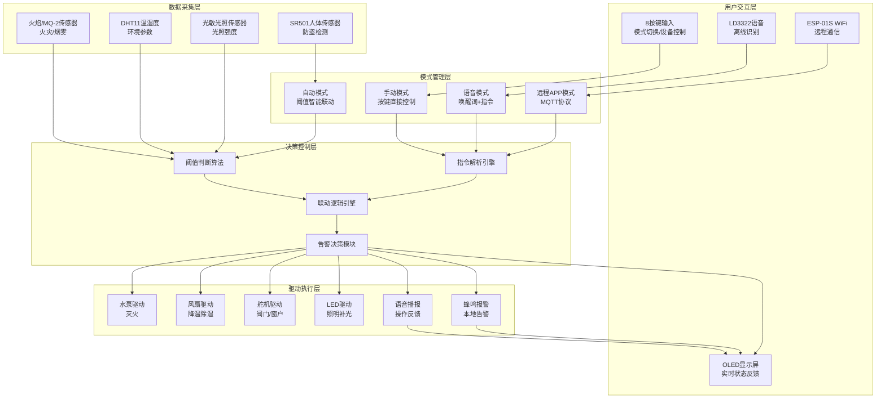

```mermaid
graph TD
    subgraph "用户交互层"
        A["8按键输入<br>模式切换/设备控制"]
        B["LD3322语音<br>离线识别"]
        C["ESP-01S WiFi<br>远程通信"]
        D["OLED显示屏<br>实时状态反馈"]
    end

    subgraph "模式管理层"
        E["自动模式<br>阈值智能联动"]
        F["手动模式<br>按键直接控制"]
        G["语音模式<br>唤醒词+指令"]
        H["远程APP模式<br>MQTT协议"]
    end

    subgraph "决策控制层"
        I[阈值判断算法]
        J[指令解析引擎]
        K[联动逻辑引擎]
        L[告警决策模块]
    end

    subgraph "驱动执行层"
        M["水泵驱动<br>灭火"]
        N["风扇驱动<br>降温除湿"]
        O["舵机驱动<br>阀门/窗户"]
        P["LED驱动<br>照明补光"]
        Q["语音播报<br>操作反馈"]
        R["蜂鸣报警<br>本地告警"]
    end

    subgraph "数据采集层"
        S["火焰/MQ-2传感器<br>火灾/烟雾"]
        T["DHT11温湿度<br>环境参数"]
        U["光敏光照传感器<br>光照强度"]
        V["SR501人体传感器<br>防盗检测"]
    end

    A --> F
    B --> G
    C --> H
    
    E --> I
    F --> J
    G --> J
    H --> J
    
    I --> K
    J --> K
    K --> L
    
    L --> M
    L --> N
    L --> O
    L --> P
    L --> Q
    L --> R
    
    S --> I
    T --> I
    U --> I
    V --> E
    
    L --> D
    Q --> D
    R --> D

```